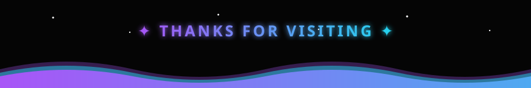

<!-- ══════════════════════════════════════════════════════════ -->
<!--   GULSHAN ✦ Cyberpunk × Aesthetic GitHub Profile    -->
<!--   Theme: #050505 matte black · purple neon · cyan          -->
<!-- ══════════════════════════════════════════════════════════ -->

<div align="center">

<!-- ⚡ ANIMATED HERO — custom-built SVG (rain, stars, particles, neon, typing) -->


<!-- typing intro line -->


<br/>

<!-- badges row -->

<a href="https://github.com/999gulshan?tab=followers"></a>


</div>

<br/>

<!-- ══════════════ ABOUT ME ══════════════ -->


## 🌸 About Me 

```yaml
name:        Gulshan
role:        Full-Stack Developer
focus:       AI + Full-Stack Apps
learning:    [ React, Node.js, AI/ML, System Design ]
goals_2026:  [ Ship 5 polished products, Master TypeScript,
               Contribute to open source ]
fun_facts:
  - I design UIs like they're album covers 🎧
  - Neon > Sunlight 🌌
  - Debugging at 3AM hits different
motto:       "Build the future, one commit at a time."
```

<br clear="right"/>

<div align="center">

## 🖥️ Developer Terminal



</div>

<br/>

<!-- ══════════════ TECH STACK ══════════════ -->
<div align="center">

## ⚡ Tech Stack ・technology


<br/><br/>

<!-- skill bars -->
<table>
<tr><td>

```text
HTML        ██████████████████░░  92%
CSS         █████████████████░░░  88%
JavaScript  ████████████████░░░░  82%
Tailwind    ███████████████░░░░░  78%
React       ██████████████░░░░░░  70%
Node.js     ████████████░░░░░░░░  62%
```

</td></tr>
</table>

<br/>


</div>

<br/>

<!-- ══════════════ LIVE DASHBOARD ══════════════ -->
<div align="center">

## 📊 Live Dashboard ・statistics


<br/><br/>


<br/><br/>


</div>

<br/>

<!-- ══════════════ SNAKE ══════════════ -->
<div align="center">

## 🐍 Contribution Snake

<picture>
  <source media="(prefers-color-scheme: dark)" srcset="https://raw.githubusercontent.com/999gulshan/999gulshan/output/github-snake-dark.svg"/>
  
</picture>

</div>

<br/>

<!-- ══════════════ FEATURED PROJECTS ══════════════ -->
<div align="center">

## 🚀 Featured Projects 

<table>
<tr>
<td width="50%">

### 🎵 MUSIC-PLAYER
*Neon music player with custom controls & visual vibes*


<a href="https://github.com/999gulshan/MUSIC-PLAYER"></a>
<a href="https://999gulshan.github.io/MUSIC-PLAYER/"></a>

</td>
<td width="50%">

### 🌸 Anime-Manga-Store
*Anime-aesthetic storefront UI — my kind of vibe*


<a href="https://github.com/999gulshan/Anime-Manga-Store"></a>
<a href="https://999gulshan.github.io/Anime-Manga-Store/"></a>

</td>
</tr>
<tr>
<td width="50%">

### ⛅ WEATHER-APP
*Live weather with a clean glass UI*


<a href="https://github.com/999gulshan/WEATHER-APP"></a>
<a href="https://999gulshan.github.io/WEATHER-APP/"></a>

</td>
<td width="50%">

### ✅ Advanced-TO-DO-LIST
*Task manager with a premium dark workflow*


<a href="https://github.com/999gulshan/Advanced-TO-DO-LIST"></a>
<a href="https://999gulshan.github.io/Advanced-TO-DO-LIST/"></a>

</td>
</tr>
</table>

</div>

<br/>

<!-- ══════════════ NOW PLAYING (Spotify) ══════════════ -->
<div align="center">

## 🎧 Now Playing ・music

<!-- Replace YOUR_SPOTIFY_USER_ID after setting up spotify-github-profile (see SETUP.md) -->
<a href="https://open.spotify.com">
  
</a>

*🎵 Probably NewJeans on repeat*

</div>

<br/>

<!-- ══════════════ ACHIEVEMENTS ══════════════ -->
<div align="center">

## 🏆 Achievements 


</div>

<br/>

<!-- ══════════════ CONNECT ══════════════ -->
<div align="center">

## 🌐 Connect

<a href="https://github.com/999gulshan"></a>
<a href="mailto:your@email.com"></a>
<a href="#"></a>
<a href="#"></a>

<br/><br/>

<!-- ══════════════ ANIMATED FOOTER ══════════════ -->


<sub>✦ Designed & built by Gulshan · #050505 × purple neon × cyan · 2026 </sub>

</div>
